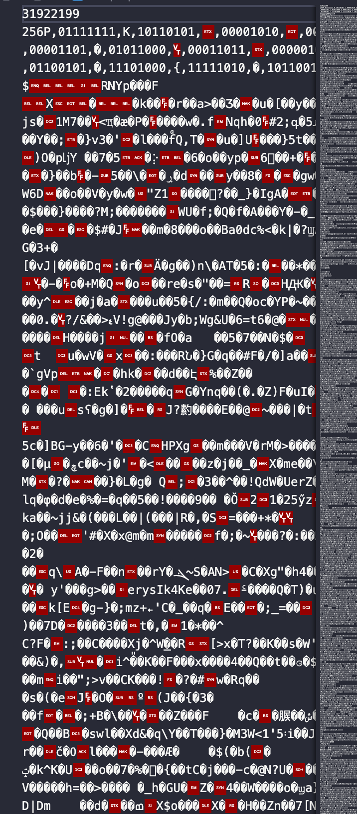

# Huffman编码实现压缩软件_实验报告
## 实验要求
![[images/1.png]]
## 实验设计思路
本次实验主要的难点在于构造Huffman树和设计压缩文件编码的结构，其中需要大量的文件读写的操作，其中我们主要采用二进制读写的操作。我们在代码中首先定义若干个结构体，方便我们构建Huffman树。构建的结构体如下所示：
```c
struct HTNode
{
    int weight;     //该节点的权重
    int parent;
    int lchild;
    int rchild;
};
```
首先是Huffman树的叶子结点，weight表示节点的权重，后面为它的parent和左右孩子。
```c
struct wcounter
{
    char c; //表示该字符的内容
    unsigned int cnt;//表示权重
};
```
其表示了该字符的种类和其权重，方便统计文件的各字符的出现频率。
接下来是该压缩程序的主要函数，首先是Select( )。
代码如下所示：
```c
void Select(struct HTNode* HT,int i,int *s1,int *s2)    //选出HT中1到i里面权值最小的序号s1和s2
{
    int temp1 = 0;
    int temp2 = 0;
    int j;
    for(int j = 1;j <= i;j++)
    {
        if((HT+j)->parent == 0) 
        {
            temp1 = (HT+j)->weight;
            break;
        }
    }
    for(j = 1;j <= i;j++)
    {
        if(((HT+j)->weight <= temp1)&&(HT+j)->parent == 0)
        {
            temp1 = (HT+j)->weight;
            *s1 = j;
        }
    }
    for(int k = 1;k <= i;k++)
    {
        if(((HT+k)->parent == 0)&&k != *s1)
        {
            temp2 = (HT+k)->weight;
            break;
        }
    }
    for(int m = 1;m <= i;m++)
    {
        if((((HT+m)->weight <= temp2)&&(HT+m)->parent == 0)&&m != *s1)
        {
            temp2 = (HT+m)->weight;
            *s2 = m;
        }
    }
}   //经验证测试该函数正确
```
后面一段注释是由于在写该大作业期间，为了防止后期的debug的困难，于是采取了每写一个模块就对其进行测试，这样让写代码的效率大大提高。对于该函数来说，我们需要选择出权值最小的两个Huffman树的节点，从而实现Huffman树的构建过程。
```c
void WeightCounter(struct wcounter **w,int *charkindnumber,char *fileloaction)     //统计字符权重的分布，构造HashTable
{
    (*charkindnumber) = 0;
    char temp;
    FILE *fp;
    fp = fopen(fileloaction,"rb");  //以二进制读
    while(1)
    {
        if(!fread(&temp,1,sizeof(char),fp)) break;
        if(*charkindnumber == 0)
        {
            w[0]->c = temp;
            (w[0]->cnt)++;
            (*charkindnumber)++;
        }else
        {
            int kmax = *charkindnumber;
            int k = 0;
            for(k = 0;k < kmax;k++)
            {
                if(w[k]->c == temp)
                {
                    (w[k]->cnt)++;
                    break;
                }
            /*    else if(w[k]->c == '\0')
                {
                    w[k]->c = temp;
                    (w[k]->cnt)++;
                    (*charkindnumber)++;
                    break;
                }*/
            }
            if(k == kmax)
            {
                w[kmax]->c = temp;
                (w[kmax]->cnt)++;
                (*charkindnumber)++;
            }
        }
    }
    fclose(fp);
}
```
这一函数用来统计各字符的出现次数，用权重表示，每出现一次就加一。该部分函数采用的读文件的方式采用fread和fwrite。
```c
void HuffmanEncoding(struct HTNode** HTree,char ***HC,struct wcounter **w,int *charkindnumber)          //构造霍夫曼树，得到压缩后个字符对应的编码表
{
    struct HTNode* p;
    int i;
    int *s1;
    int *s2;
    char *cd;
    int start;
    int l = 0;
    s1 = (int*)malloc(sizeof(int));
    s2 = (int*)malloc(sizeof(int));
    if(*charkindnumber <= 1) return;
    int m = 2*(*charkindnumber)-1;
    (*HTree) = (struct HTNode*)malloc((m+1)*sizeof(struct HTNode));     //0号单元未用
    for(p = (*HTree),i = 1;i <= (*charkindnumber);i++,p++)
    {
        p->weight = w[l]->cnt;
        p->lchild = 0;
        p->parent = 0;
        p->rchild = 0;
        l++;
    }
    for(;i <= m;i++,p++)
    {
        p->lchild = 0;
        p->parent = 0;
        p->rchild = 0;
        p->weight = 0;
    }
    for(i = (*charkindnumber)+1;i <= m;i++)  //建立霍夫曼树
    //在HTree[1,i-1]中选择parent为0且weight最小的两个结点，其序号分别为s1和s2
    {
        Select(*HTree,i-1,s1,s2);
        (*HTree)[*s1].parent = i;
        (*HTree)[*s2].parent = i;
        (*HTree)[i].lchild = *s1;
        (*HTree)[i].rchild = *s2;
        (*HTree)[i].weight = (*HTree)[*s1].weight+(*HTree)[*s2].weight;
    }
    //下面为从叶子到根逆向求每个字符的霍夫曼编码
    (*HC) = (char**)malloc(((*charkindnumber)+1)*sizeof(char*));
    cd = (char*)malloc((*charkindnumber)*sizeof(char));
    cd[(*charkindnumber)-1] = '\0';         //结束编码符
    for(int i = 1;i <= (*charkindnumber);i++)
    {
        int c = 0;
        int f = 0;
        start = (*charkindnumber)-1;
        for(c = i,f = (*HTree)[i].parent;f != 0;c = f,f = (*HTree)[f].parent)
        {
            if((*HTree)[f].lchild == c) cd[--start] = '0';
            else cd[--start] = '1';
        }
        (*HC)[i] = (char*)malloc(((*charkindnumber)-start)*sizeof(char));
        strcpy((*HC)[i],&cd[start]);
    }
    free(cd);
}
```
这一函数是得到Huffman树的过程，这一过程利用课本上的得到Huffman树的方法，在已知各个字符的权重的情况下，采用静态数组，动态分配$2n+1$的空间，构建Huffman树，之后再利用结构体中的左右孩子和parent的指针，来得到对应字符的Huffman编码。
```c
void PrintHuffmancode(struct wcounter **w,int *charkindnumber,char **huffmancode)
{
    for(int i = 0;i < *charkindnumber;i++)
    {
        printf("字符:%c",w[i]->c);
        printf("编码为:%s\n",*(huffmancode+i+1));
    }
}
```
该部分代码用于打印Huffman编码，用
```c
void CreateZipFile(char **huffmancode,struct wcounter **w,char *filelocation,int *charkindnumber)    //第一个char存放结尾补0的个数，然后存放霍夫曼编码表，为字符(char)->霍夫曼编码(以char为单位存放，中间以','隔开结尾以\n为标记即可)
{
    FILE *fp1;  //用来写zip文件
    FILE *fp2;  //用来读原文件
    long filelengeh;
    long zipfilelength;
    long counter = 0;   //用来统计该文件会用多少位编码
    char zero;          //结尾补0的个数
    //先写结尾补0的个数
    if(!(fp2 = fopen(filelocation,"rb")))
    {
        printf("can not open file!\n");
        return;
    }
    fseek(fp2,0L,SEEK_END);
    filelengeh = ftell(fp2);
    rewind(fp2);
    char zipname[20];
    printf("输入生成压缩文件的路径名称:");
    scanf("%s",zipname);
    fp1 = fopen(zipname,"w");
    fprintf(fp1,"%ld",filelengeh);
    fprintf(fp1,"%c",'\n');
    fprintf(fp1,"%d",*charkindnumber);//写入要读出多少个字符打表。
    for(int i = 0;i < *charkindnumber;i++)
    {
        char temp;
        temp = w[i]->c;
        fprintf(fp1,"%c",temp);
        temp = ',';
        fprintf(fp1,"%c",temp);
        fprintf(fp1,"%s",*(huffmancode+i+1));
        fprintf(fp1,"%c",temp);
    }
    //至此将0数和霍夫曼表写进文件头的操作都完成，下面进行位操作写霍夫曼编码
    char buffer;
    int readcharnum = 0;
    int count = 0;  //判断计数是否达到八
    while(1)
    {
        char temp;
        int i = 0;
        int j;
        if(!fread(&temp,1,sizeof(char),fp2)) break;
        readcharnum++;
        for(i = 0;i < *charkindnumber;i++)
        {
            if(w[i]->c == temp) break;
        }
        char* code = *(huffmancode+i+1);
        for(j = 0;code[j] != '\0';j++)
        {
            if(*(code+j) == '0') 
            {
                buffer = buffer<<1; 
                count++;
                if(count == 8)
                {
                    fprintf(fp1,"%c",buffer);
                    count = 0;
                } 
            }
            else if(*(code+j) == '1')
            {
                buffer = buffer<<1;
                buffer = buffer|1;
                count++;
                if(count == 8)
                {
                    fprintf(fp1,"%c",buffer);                        
                    count= 0;
                }
            }
        }
        if(readcharnum == filelengeh) 
        {
            if(count != 8) 
            {
                for(;count != 8;count++)
                {
                    buffer = buffer<<1;
                }
                fprintf(fp1,"%c",buffer);
                count = 0;
            }
        }
    }
    fseek(fp1,0L,SEEK_END);
    zipfilelength = ftell(fp1);
    float zipzip;
    zipzip = (float) zipfilelength/filelengeh;
    printf("压缩比为:%f\n",zipzip);
    fclose(fp2);
    fclose(fp1);
}
```
该部分代码为该压缩软件的关键代码之一，这部分代码用于创建并写入压缩文件，该部分的代码详解在后面介绍。
```c
void Createback()
{
    FILE *fp1;
    char filebacklocation[30] = "\0";
    printf("输入要解压的路径:");
    scanf("%s",filebacklocation);
    fp1 = fopen(filebacklocation,"r");
    long filelength;   //得到结尾0的个数
    int charkindnumber;
    struct wcounter w[256];
    int codecnt = 0;
    char tempppp;
    fscanf(fp1,"%ld",&filelength);
    fscanf(fp1,"%c",&tempppp);
    fscanf(fp1,"%d",&charkindnumber);
    char huffmancode[charkindnumber+1][50];
    for(int i = 0;i <= charkindnumber;i++)
    {
        for(int j = 0;j < 50;j++)
        {
            huffmancode[i][j] = '\0';
        }
    }
    while(1)
    {
        if(codecnt == charkindnumber) break;
        char temp;
        fscanf(fp1,"%c",&w[codecnt].c);
        codecnt++;
        fscanf(fp1,"%c",&temp);
        int u = 0;
        do
        {
            fscanf(fp1,"%c",&temp);
            if(temp != ',') 
            {
                huffmancode[codecnt][u] = temp;
                u++;
            }else 
            {
                u = 0;
                break;
            }
        }while(1);
    }
    //经过测试，得到了完整的霍夫曼编码表和zero和charkindnumber
    //接下来就是读文件内容
    FILE *fp2;
    char backfile[30] = "\0";
    printf("请输入生成文件的名称:");
    scanf("%s",backfile);
    fp2 = fopen(backfile,"w");
    long loc;
    loc = ftell(fp1); 
    fclose(fp1);
    fp1 = fopen(filebacklocation,"rb");
    fseek(fp1,loc,SEEK_SET);
    char buffer;
    char findit[50] = "\0";
    int cnt = 0;
    unsigned char ismsbzero = 128;
    while(1)
    {
        if(!fread(&buffer,1,sizeof(char),fp1)) break;
        while(1)
        {
            if(cnt == 8)
            {
                cnt = 0;
                break;
            }
            if((buffer&ismsbzero) == 0)     //最低位为0
            {
                buffer = buffer << 1;
                strcat(findit,"0");
                cnt++;
            } 
            else
            {
                buffer = buffer << 1;
                strcat(findit,"1");
                cnt++;
            }
            int i = 1;
            for(;i < charkindnumber+1;i++)
            {
                if(strcmp(findit,huffmancode[i]) == 0) break;
            }
            if(i != charkindnumber+1)
            {
                fprintf(fp2,"%c",w[i-1].c);
                if(ftell(fp2) == filelength) break;
                for(int u = 0;u < 50;u++)
                {
                    findit[u] = '\0';
                }
            }
        }
    }
}
```
该部分代码为解压的部分，也是Huffman压缩的关键代码之一，这一部分的代码详解也将在后面介绍。

之后为main函数，该部分函数调用了上面的各个模块的函数，最终构成了整个压缩软件。其中压缩文件的地址和生成的解压文件的地址都是手动输入，这样就确保了程序比较友好的可交互性。
```c
int main()
{
    struct wcounter *w[256];         //统计权重
    int *charkindnumber;    //统计出现了多少种字符 
    char filelocation[300] = "\0";
    char ***huffmancode;     //得到的编码表
    struct HTNode** HTree;
    huffmancode = (char***)malloc(sizeof(char**));
    HTree = (struct HTNode**)malloc(sizeof(struct HTNode*));
    //给指针分配指向的空间
    for(int i = 0;i<256;i++)
    {
        w[i] = (struct wcounter*)malloc(sizeof(struct wcounter));
    }
    charkindnumber = (int*)malloc(sizeof(int));
    for(int i = 0;i < 256;i++)    //初始化统计权重的数组
    {
        w[i]->c = '\0';
        w[i]->cnt = 0;
    }
    int iszip = 0;
    int iskeepgoing = 1;
    while(iskeepgoing)
    {
        printf("输入你想进行的操作:1.压缩 2.解压:\n");
        scanf("%d",&iszip);
        switch (iszip)
        {
            case 1: 
                    printf("输入你想压缩的文件路径:\n");
                    scanf("%s",filelocation);     //读入文件地址
                    WeightCounter(w,charkindnumber,filelocation);    //统计权重
                    //(*charkindnumber)--;
                    printf("该文件共有字符种类:");
                    printf("%d个\n",*charkindnumber);
                    //在此调试WeightCounter(),没有出现问题
                    printf("每个字符对应的霍夫曼编码:\n");
                    HuffmanEncoding(HTree,huffmancode,w,charkindnumber);
                    PrintHuffmancode(w,charkindnumber,*huffmancode);
                    CreateZipFile(*huffmancode,w,filelocation,charkindnumber);
                    break;
            case 2: Createback();
                    break;
            default:printf("输入错误!");
        }
lp:     printf("是否想继续操作? 1.继续 0.结束程序\n");
        scanf("%d",&iskeepgoing);
        if(iskeepgoing != 1 && iskeepgoing != 0) 
        {
            printf("输入错误!\n");
            goto lp;
        }
    }
``` 
## 关键代码详解
首先为创建压缩文件的代码，下面先附上该部分的代码：
```c
void CreateZipFile(char **huffmancode,struct wcounter **w,char *filelocation,int *charkindnumber)    //第一个char存放结尾补0的个数，然后存放霍夫曼编码表，为字符(char)->霍夫曼编码(以char为单位存放，中间以','隔开结尾以\n为标记即可)
{
    FILE *fp1;  //用来写zip文件
    FILE *fp2;  //用来读原文件
    long filelengeh;
    long zipfilelength;
    long counter = 0;   //用来统计该文件会用多少位编码
    char zero;          //结尾补0的个数
    //先写结尾补0的个数
    if(!(fp2 = fopen(filelocation,"rb")))
    {
        printf("can not open file!\n");
        return;
    }
    fseek(fp2,0L,SEEK_END);
    filelengeh = ftell(fp2);
    rewind(fp2);
    char zipname[20];
    printf("输入生成压缩文件的路径名称:");
    scanf("%s",zipname);
    fp1 = fopen(zipname,"w");
    fprintf(fp1,"%ld",filelengeh);
    fprintf(fp1,"%c",'\n');
    fprintf(fp1,"%d",*charkindnumber);//写入要读出多少个字符打表。
    for(int i = 0;i < *charkindnumber;i++)
    {
        char temp;
        temp = w[i]->c;
        fprintf(fp1,"%c",temp);
        temp = ',';
        fprintf(fp1,"%c",temp);
        fprintf(fp1,"%s",*(huffmancode+i+1));
        fprintf(fp1,"%c",temp);
    }
    //至此将0数和霍夫曼表写进文件头的操作都完成，下面进行位操作写霍夫曼编码
    char buffer;
    int readcharnum = 0;
    int count = 0;  //判断计数是否达到八
    while(1)
    {
        char temp;
        int i = 0;
        int j;
        if(!fread(&temp,1,sizeof(char),fp2)) break;
        readcharnum++;
        for(i = 0;i < *charkindnumber;i++)
        {
            if(w[i]->c == temp) break;
        }
        char* code = *(huffmancode+i+1);
        for(j = 0;code[j] != '\0';j++)
        {
            if(*(code+j) == '0') 
            {
                buffer = buffer<<1; 
                count++;
                if(count == 8)
                {
                    fprintf(fp1,"%c",buffer);
                    count = 0;
                } 
            }
            else if(*(code+j) == '1')
            {
                buffer = buffer<<1;
                buffer = buffer|1;
                count++;
                if(count == 8)
                {
                    fprintf(fp1,"%c",buffer);                        
                    count= 0;
                }
            }
        }
        if(readcharnum == filelengeh) 
        {
            if(count != 8) 
            {
                for(;count != 8;count++)
                {
                    buffer = buffer<<1;
                }
                fprintf(fp1,"%c",buffer);
                count = 0;
            }
        }
    }
    fseek(fp1,0L,SEEK_END);
    zipfilelength = ftell(fp1);
    float zipzip;
    zipzip = (float) zipfilelength/filelengeh;
    printf("压缩比为:%f\n",zipzip);
    fclose(fp2);
    fclose(fp1);
}
```
我们现在再来分析一下这段代码。这里我们考虑了压缩文件的文件编码格式。为了解决文件的结尾0的补全导致文件解压解压时会与原文件有些许不同，我们决定在文件的开头存下该文件的文件大小，然后换行，这样的话我们在解压时解压到满足文件大小的字节后就停止解压，这样就完成了结尾0的判断。而对于之后，因为解压的时候我们并未得到Huffman树，故我们并不知道对应的编码，故最简单的方法就是将Huffman编码表打在文件头，这样我们就完成了对文件的预操作。之后就是大量的位操作来将字符写入压缩文件中。我们利用一个buffer，在读到一个字符时，根据其Huffman编码，对其位操作，如果是0就左移，如果是1就左移后与1相或，之后每当buffer写满8位之后，就将其写入文件。这样我们就实现了位操作来将字符压缩。

下面的代码是解压部分的代码：
```c
void Createback()
{
    FILE *fp1;
    char filebacklocation[30] = "\0";
    printf("输入要解压的路径:");
    scanf("%s",filebacklocation);
    fp1 = fopen(filebacklocation,"r");
    long filelength;   //得到结尾0的个数
    int charkindnumber;
    struct wcounter w[256];
    int codecnt = 0;
    char tempppp;
    fscanf(fp1,"%ld",&filelength);
    fscanf(fp1,"%c",&tempppp);
    fscanf(fp1,"%d",&charkindnumber);
    char huffmancode[charkindnumber+1][50];
    for(int i = 0;i <= charkindnumber;i++)
    {
        for(int j = 0;j < 50;j++)
        {
            huffmancode[i][j] = '\0';
        }
    }
    while(1)
    {
        if(codecnt == charkindnumber) break;
        char temp;
        fscanf(fp1,"%c",&w[codecnt].c);
        codecnt++;
        fscanf(fp1,"%c",&temp);
        int u = 0;
        do
        {
            fscanf(fp1,"%c",&temp);
            if(temp != ',') 
            {
                huffmancode[codecnt][u] = temp;
                u++;
            }else 
            {
                u = 0;
                break;
            }
        }while(1);
    }
    //经过测试，得到了完整的霍夫曼编码表和zero和charkindnumber
    //接下来就是读文件内容
    FILE *fp2;
    char backfile[30] = "\0";
    printf("请输入生成文件的名称:");
    scanf("%s",backfile);
    fp2 = fopen(backfile,"w");
    long loc;
    loc = ftell(fp1); 
    fclose(fp1);
    fp1 = fopen(filebacklocation,"rb");
    fseek(fp1,loc,SEEK_SET);
    char buffer;
    char findit[50] = "\0";
    int cnt = 0;
    unsigned char ismsbzero = 128;
    while(1)
    {
        if(!fread(&buffer,1,sizeof(char),fp1)) break;
        while(1)
        {
            if(cnt == 8)
            {
                cnt = 0;
                break;
            }
            if((buffer&ismsbzero) == 0)     //最低位为0
            {
                buffer = buffer << 1;
                strcat(findit,"0");
                cnt++;
            } 
            else
            {
                buffer = buffer << 1;
                strcat(findit,"1");
                cnt++;
            }
            int i = 1;
            for(;i < charkindnumber+1;i++)
            {
                if(strcmp(findit,huffmancode[i]) == 0) break;
            }
            if(i != charkindnumber+1)
            {
                fprintf(fp2,"%c",w[i-1].c);
                if(ftell(fp2) == filelength) break;
                for(int u = 0;u < 50;u++)
                {
                    findit[u] = '\0';
                }
            }
        }
    }
}
```
这一部分的代码是解压压缩文件的部分。根据我们在先前制定的编码格式，在扫描压缩文件时，首先得到我们要解压出来的文件的大小，然后再阅读表头，通过同样的方式存储Huffman编码，从而得到对应的编码表。在得到编码表之后，我们开始一个字节一个字节的阅读，同样利用buffer读取字节，判断得到的位数是0还是1，根据是0还是1将其存放在findit( )数组里，对于这个数组，每次更新后就去遍历一遍Huffman编码表，如果找到匹配的就将对应字符写入解压文件中，同时findit清空。按照这个思路，我们最终得到了整个解压文件。
## 调试分析
在本次程序中，由于是分模块化设计同时对每一个模块单独进行调试，故本次出现的bug较少，且调试的时候很快就能解决bug。

本次代码的wcounter( )函数中曾经出现了bug，其测试结果总会将文件的末尾字节的权重多统计一个。一开始分析算法时未能找到bug所在，之后便翻阅了该函数中用到的一些文件读写函数的定义，发现了问题所在。该问题是出现在fread( )函数终止的判断上。当fread( )读不到内容时，它并不会更新函数的参数，导致最后一个字节的读取时重复统计。并且由于是二进制文件的读写，我一开始判断读写完毕的标志是\0，但在二进制读写中这是并不对的。fread( )读到内容时它会返回1，读不到内容时它会返回0，我们根据这一特点能比较完美的判断文件读写的结束。

还有一些bug出现在得到Huffman编码时，由于一些循环的边缘未能处理好，例如小于等于写成了小于，这就导致了有时候Huffman编码得到的是空，导致程序有问题，不过得益于分模块测试，这一问题在代码写一半的时候就被发现并且解决了。

另外的一些bug是出现在文件的压缩和解压一块，由于该部分用到了大量的循环操作，在这里的一些变量的范围与寿命没有维护好，导致了程序的逻辑错误，在仔细对照代码之后完成了该部分的debug。

下面放上代码的调试结果：

首先是压缩和解压txt文件。
<center class = "half">
    
</center>
这里我们得到的压缩率为0.850499。
下面是原文件。
<center class = "half">
    
</center>
下面是压缩出来的文件。
<center class = "half">
    
</center>
下面是解压出来的文件。
<center class = "half">
    
</center>
文件大小与内容和之前完全一致，并且尾部没有未知字符。

上面是对txt文件压缩与解压的测试下面附上对png图片的压缩解压测试结果:

下面是原图片：
<center class = "half">
    
</center>
接下来是压缩的过程：
<center class = "half">
    
</center>
由于png图片出现的字符均匀，且256种字符均会出现，故每个字符的Huffman编码基本都会是8位，这样就会导致压缩效率很低。由于我们将Huffman编码表放在了文件头，这样的话有时会出现压缩之后的文件变大的情况，这种情况是Huffman编码的原理造成的。
下面展示了该图片压缩后的文件：
<center class = "half">
    
</center>
接下来是解压的过程：
<center class = "half">
    
</center>
生成的图片如下所示：
<center class = "half">
    
</center>
结果完全一致。

在这之后，我又压缩了视频、音频等文件。压缩与解压结果均正常。

对于文件结构来说，压缩包的结构是最为严谨的，我们接下来测试助教给的压缩包。
<center class = "half">
    
</center>
我们对其进行压缩，得到如下所示结果：
<center class = "half">
    
</center>
下面是压缩文件的截图：
<center class = "half">
    
</center>
下面是对其解压的测试：
<center class = "half">
    
</center>
接下来是该解压的压缩包点开之后的场景：
<center class = "half">
    
</center>

在打开该压缩包后，我们发现其中的文件均正常，点开txt文件，拉到末尾，并未出现异常字符，这表明我们的压缩程序没有问题。

对于算法的时空复杂读来说，建立Huffman树的时间复杂度为O(n)，空间复杂度也为O(n)，而对于解压与压缩时，它的时间复杂度是O($n^2$)，空间复杂度是O(n)。
## 实验总结
本次实验难度适中，主要是大量运用了文件读写的操作，由于文件读写是上学期的内容，本次实验很好的复习了相关的函数操作。除此之外，本次实验加深了对Huffman树的理解，对其其应用有了一些自己的认识。同时与离散事件模拟的实验不同的是，本次实验的代码在运行的时候会花费一些时间，由于这种因素的存在，在写代码时更加注重对时间的优化。最重要的是，本次实验采用的模块化设计与分模块的测试对以后的编程有着非常大的作用，是一个应该坚持的良好的编程习惯。
## 文件附录
提交文件包含一个源代码文件main.c